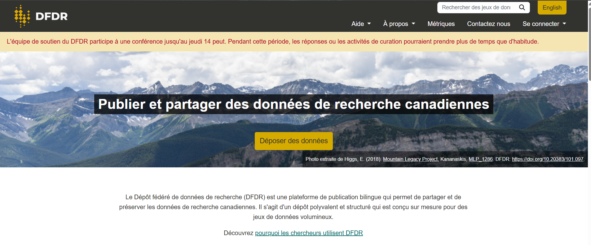

# Qu'est-ce que le DFDR ?

## Qu'est-ce que le DFDR ? {.center}

::: {style="text-align: left;font-size: 90%"}
- Plateforme **bilingue** canadienne de partage et préservation.
- Financé par l'[Alliance de recherche numérique du Canada]{style="color:green;"}.
- **Accès public** pour trouver et télécharger des données.
- **Dépôt** réservé aux chercheurs et bibliothécaires admissibles.
- **[1 To de stockage gratuit]{style="color:green;"}** par défaut pour les déposants.
:::

# Pourquoi utiliser le DFDR ?

## Pourquoi utiliser le DFDR ? {.center}

::: {style="text-align: left;font-size: 80%"}
- Dépôt **national et bilingue**.
- Prise en charge des **gros volumes de données** (via Globus).
- Services intégrés de **curation et préservation**.
- Stockage sécurisé et **réparti géographiquement**.
- Fonctionnalités avancées :
  - **Collaboration** avec d'autres titulaires de comptes.
  - **Embargos optionnels** (données et métadonnées).
  - Partage pour **évaluation externe (pairs)** avant publication.
  - Intégration **ORCID**.
:::

## Statistiques du service {.center}

:::: {layout-ncol="3"}
::: {#first-column}
###  Comptes
**~500**
:::

::: {#second-column}
###  Ensembles
**803**
:::

::: {#third-column}
###  Volume
**443 To**
:::
::::

::: {style="text-align: center; font-size: 70%"}
{fig-alt="" fig-align="center" width="600" height="400"}
:::

# Pour commencer : Compte et dépôt de données

## Créer un compte DFDR {.center}

::: {style="text-align: left;font-size: 85%"}
1. Allez sur **[frdr-dfdr.ca](https://www.frdr-dfdr.ca/repo/)**.
2. Cliquez sur **Déposer des données** ou **Connexion**.
3. Connectez-vous via :
   - Votre établissement ou Calcul Canada.
   - Votre identifiant **ORCID**.
   - Un compte **Globus** avec votre courriel institutionnel.

::: callout-caution
**Attention :** Utilisez toujours la même méthode pour vous connecter à votre compte !
:::
:::

## Dépôt de données : Étapes {.center}

::: {style="text-align: left;font-size: 75%"}
-  **Débuter :** Sélectionnez « Soumettre un nouvel ensemble de données ».
-  **Stockage :** Choisissez la collection (Général) et ajoutez vos collaborateurs.
-  **Métadonnées :** Remplissez les champs obligatoires (Titre, auteurs, etc.).
-  **Accès :** Définissez un embargo ou un accès pour évaluation, si désiré.
-  **Téléversement :** Ajoutez vos données et votre fichier README via navigateur ou **Globus**.
-  **Soumission :** Révisez les métadonnées et validez.
-  **Curation :** L'équipe du DFDR procède à la révision.
:::

# Après le dépôt : Curation, publication et préservation

## Après le dépôt {.center}

::: {style="text-align: center; font-size: 150%; font-weight: bold; margin-top: 50px;"}
[Curation]{style="color:green;"}  [Publication]{style="color:blue;"}  [Préservation]{style="color:purple;"}
:::

## La curation des données {.center}

::: {style="text-align: left;font-size: 80%"}
La curation ajoute de la valeur en optimisant les données pour leur **découverte et réutilisation futures**.

**Processus (basé sur CURATE(D)) :**
- Vérifier et comprendre la documentation.
- Enrichir les métadonnées pour la repérabilité.
- Transformer les formats de fichiers pour l'accessibilité.
- Évaluer selon les **principes FAIR**.
:::

**Rôle du DFDR :** Vérification des licences, de l'attribution, de la dénomination et des sensibilités potentielles.

::: callout-tip
Les chercheurs font partie intégrante de ce processus interactif !
:::

## Publication des données {.center}

::: {style="text-align: left;font-size: 90%"}
- Attribution d'un **[DOI]{style="color:green;"}** unique.
- Données **indexées pour la découverte** (Lunaris, DataCite, Google Dataset Search, etc.).
- Données téléchargeables librement ou via Globus.

::: callout-important
### N'oubliez pas de citer vos données !
Incluez votre DOI dans vos publications, votre CV et votre profil ORCID.
:::
:::

## Après la publication {.center}

### Vos données restent les vôtres !

::: {style="text-align: left;font-size: 90%"}
- Vous conservez vos droits et responsabilités.
- Vous pouvez **réutiliser** votre ensemble de données.
- Vous pouvez créer une **nouvelle version** si des mises à jour sont nécessaires.
- Toute modification apportée doit être transparente.
:::

## Ressources et soutien {.smaller}

::::: {layout-ncol="2"}
:::: {#first-column}
### Matériel d'appui

-   [Documents du DFDR](https://www.frdr-dfdr.ca/docs/en/depositing_data/)
-   [Guide de l'utilisateur Borealis](https://borealisdata.ca/guides/en/latest/user/)
-   [Ressources de formation de l’Alliance](https://alliancecan.ca/en/services/research-data-management/learning-and-training/training-resources)
::::

### Services d'appui:

::: {style="text-align: left;font-size: 80%"}
Communiquez avec nous pour vérifier que vos données sont bien préparées et pourront être partagées efficacement avec la communauté de recherche.

-   Courriel: rdm-gdr\@alliancecan.ca
-   [Site web du DFDR](https://www.frdr-dfdr.ca/repo/)
:::